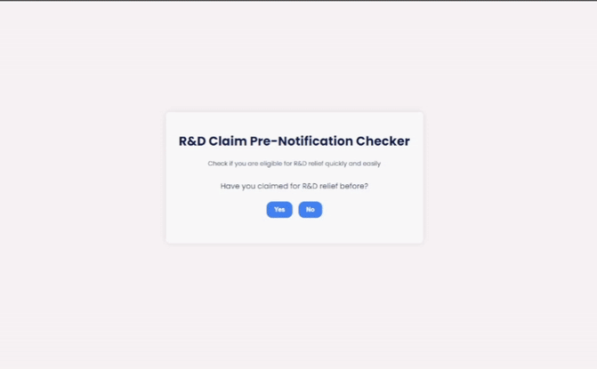

# PNF Widget

A vanilla JS widget to determine if an R&D claim requires prenotification to HMRC.

## Demo



## 🛠️ Installation & Deployment

To test the widget's functionality standalone:

### Requirements

* Node.js (v18+)
* npm (v8+)

## 🛠️ Installation

1. Clone the repository:

```bash
git clone https://github.com/vendron/pnf-widget.git
cd pnf-widget
```

### 🚀 Deployment

Execute the following command in your terminal when in the root directory of the project:

```bash
npm run start:dev
```

This will start a local server and open the widget in your default web browser.

## ⚙️Widget Configuration

The widget is initialised in `src/scripts/main.js`. The `WidgetView` and `WidgetController` are instantiated with an options object to customise the IDs of the HTML elements they interact with.

The default IDs for this project are:


| Purpose                       | Default ID            | Linked Question ID |
| ------------------------------- | ----------------------- | -------------------- |
| Question 1 container          | `question1`           | N/A                |
| Question 2 container          | `question2`           | N/A                |
| Question 3 container          | `question3`           | N/A                |
| Question 4 container          | `question4`           | N/A                |
| Question 5 container          | `question5`           | N/A                |
| Result container              | `result`              | N/A                |
| Result text                   | `pnfResult`           | N/A                |
| Last-filing date input        | `lastClaimFilingDate` | `question2`        |
| Claim-period start date input | `cpStartDate`         | `question3`        |
| Claim-period end date input   | `cpEndDate`           | `question3`        |

> See the `WidgetViewOptions` and `WidgetControllerOptions` typedefs in for more details.

## 🔌Integration

1. Add the CSS and JS files to your project.
2. Add the HTML structure to your page.
3. Create a new instance of the `WidgetController` class, passing in the IDs of the HTML elements you want to use (Default or custom).